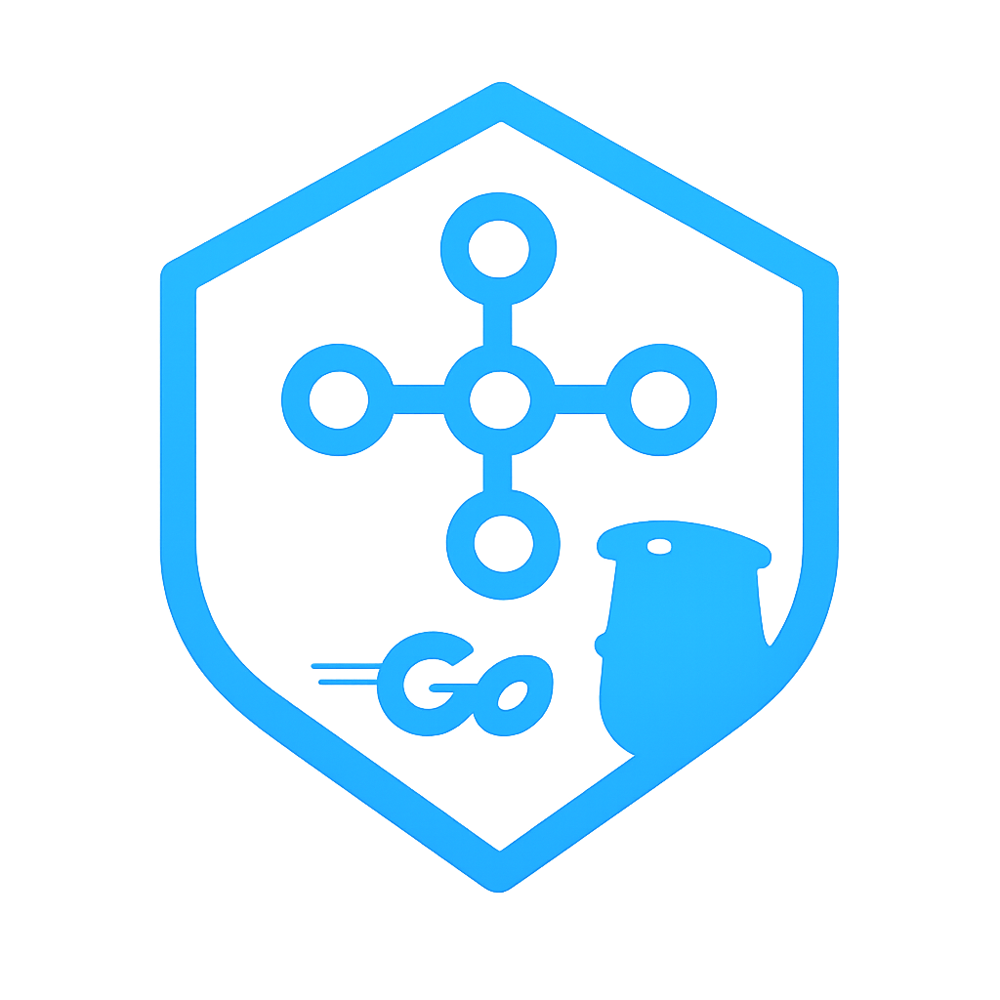

<div align="center">
  <h1 align="center">isoAutomate Go SDK</h1>
  
  <p align="center">
    <b>The Sovereign Browser Infrastructure & Orchestration Platform</b>
  </p>

  <a href="https://pkg.go.dev/github.com/isoautomate/isoautomate-go">
    
  </a>
  <a href="https://opensource.org/licenses/MIT">
    
  </a>
  <a href="https://isoautomate.com/docs">
    
  </a>
</div>

<br />

<div align="center">

</div>

---

## Introduction

The **isoAutomate Go SDK** is a production-grade client that acts as a **remote control** for browsers running on **isoFleet**, isoAutomate’s Redis-backed browser orchestration infrastructure.

Your **Go code runs locally**, while **real browsers run remotely** inside fully isolated, disposable containers.

This architecture enables:

- Deterministic automation
- Strong isolation (no cross-session leaks)
- Scalable browser fleets
- Native video, screenshots, MFA, and persistence

---

## Installation

```bash
go get github.com/isoautomate/isoautomate-go
```

## Configuration

The SDK requires a Redis connection to communicate with isoFleet.
You may configure it using environment variables or direct initialization.

### Method 1: Environment Variables (.env)

**Option A: Single Redis URL**
```ini
REDIS_URL=rediss://:password@host:port/0
```

**Option B: Individual Fields**
```ini
REDIS_HOST=localhost
REDIS_PORT=6379
REDIS_PASSWORD=yourpassword
REDIS_DB=0
REDIS_SSL=false
```

### Method 2: Direct Initialization

**Using Connection String**
```go
import "github.com/isoautomate/isoautomate-go"

// Pass the URL directly
client := isoautomate.NewClient("redis://:password@localhost:6379/0")
```

**Using Environment Variables (Recommended)**
```go
// Pass empty string to load from .env or system vars
client := isoautomate.NewClient("")
```

## Usage Examples

### Standard Usage
```go
package main

import (
    "fmt"
    "log"
    "github.com/isoautomate/isoautomate-go"
)

func main() {
    client := isoautomate.NewClient("")
    // Ensure we release the browser when function exits
    defer client.Close()

    // 1. Acquire a session (Record = true)
    err := client.Acquire("chrome", true)
    if err != nil {
        log.Fatalf("Acquire failed: %v", err)
    }

    // 2. Automate
    client.OpenURL("https://example.com")
    
    // 3. Assert (Screenshots saved locally on failure)
    err = client.AssertText("Example Domain", "h1")
    if err != nil {
        log.Printf("Assertion failed: %v", err)
    }

    // 4. Release explicitly if you want to access video URL immediately
    // (Otherwise defer client.Close() handles it)
    client.Release()
    
    fmt.Printf("Session Video: %s\n", client.VideoURL)
}
```

Go uses `defer` to ensure the browser is released even if the function panics or returns early.

## Core Features

### Commercial Assertions
```go
err := client.AssertText("Checkout Complete", "#status")
if err != nil {
    // Screenshot is already saved to screenshots/failures/
    log.Println(err)
}
```

The SDK handles screenshots automatically upon failure.

### Video Recording
```go
client.Acquire("chrome", true) // true = record
client.OpenURL("https://example.com")
client.Release()

// Video URL is populated after release
fmt.Println(client.VideoURL)
```

### MFA (Multi-Factor Authentication)
```go
code, err := client.GetMFACode("YOUR_TOTP_SECRET")
if err == nil {
    client.Type("#otp_input", code, 5.0)
}
```

### Cookies
```go
// Save to local file
client.SaveCookies("cookies.json")

// Load from local file
client.LoadCookies("cookies.json", nil)
```

### File Uploads
```go
client.UploadFile("input[type='file']", "./document.pdf")
```

### Stealth & Low-Level Control
```go
ua, _ := client.GetUserAgent()
fmt.Println(ua)

// Execute arbitrary JS
result, _ := client.Evaluate("navigator.webdriver")
```

## Build Instructions

```bash
# Verify dependencies
go mod tidy

# Build
go build
```

## License
**MIT License**
**Copyright (c) 2026 isoAutomate**
